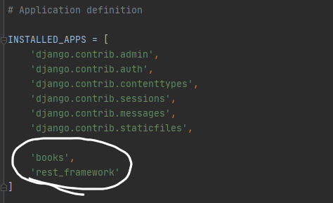
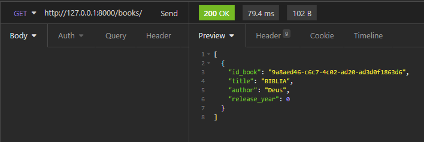

>Boa parte do projeto foi beaseado <a href="https://www.youtube.com/watch?v=wtl8ZyCbTbg&list=PLcM_74VFgRhpyCtsNXyBUf27ZRbyQnEEb">nesse vídeo</a> e <a href="https://pythonacademy.com.br/blog/construcao-de-apis-com-django-rest-framework">nesse artigo</a>. Se assim como eu, você entrou agora no mundo BackEnd, recomendo fortemente tais materiais. <br>Escrevi esse readme com a intenção de revisar o que aprendi e também ajudar aqueles com caminhos similares no mundo tech. Espero que você aprenda algo novo! 👍

# Getting Started
```bash
# Clone repository
git clone https://github.com/mikaelsonbraz/API_Biblioteca.git

# Create Virtual Environment
python -m venv venv && ./venv/Scripts/Activate.ps1

# Install dependencies
pip install -r requirements.txt

# Run Application
python manage.py runserver
```

# API para uma biblioteca

* [Introdução](#introdução)
* [Preparando o Ambiente](#preparando-o-ambiente)
* [Projeto x App](#projeto-x-app)
* [Criando os modelos e API](#criando-os-modelos-e-api)
* [Criação das rotas](#criação-das-rotas)
* [Getting Started](#getting-started)

# Introdução
A ideia do projeto é que possamos armazenar livros e seus atributos dentro de um banco de dados e realizar as operações de <a href="https://github.com/Mesheo/first-crud-django">CRUD</a> sem precisar de uma interface gráfica. Assim, outra aplicação poderá se comunicar com a nossa de forma eficiente.<br> Esse é o conceito de API (Application Programming Interface)

# Preparando o ambiente
Aqui temos a receita de bolo pra deixar a sua máquina pronta para levantar um servidor com o django e receber aquele **200** bonito na cara

```bash
>python -m venv venv #criando ambiente virtual na sua versao do python
>./venv/Scripts/Activate.ps1 #Ativando o ambiente virtual
>pip install django djangorestframework #instalação local das nossas dependências
```
O lance do ambiente virtual é que todas suas dependências *(que no python costumam ser muitas)*  ficam apenas num diretório específico. <br>
Logo, com uma venv você pode criar projetos que usam versões diferentes da mesma biblioteca sem que haja conflito na hora do import.

# Projeto x App
No django cada **project** pode carregar múltiplos **apps**, como um projeto site de esportes que pode ter um app para os artigos, outro para rankings etc.<br>
Ainda no terminal usamos os comandos a seguir para criar o project **library** que vai carregar nosso app **books**. 

```bash
>django-admin startproject library . #ponto indica diretório atual
>django-admin startapp books
>python manage.py runserver #pra levantarmos o servidor local com a aplicação
```

Para criar as tabelas no banco de dados (Por enquanto *Sqlite3*) executamos o comando
```bash
>python manage.py migrate
```

# Criando os modelos e API
No arquivo **./biblioteca/settings.py** precisamos indicar ao nosso projeto library sobre a existência do app books e também o uso do rest framework. Portanto adicionamos as seguintes linhas sublinhadas




Agora em **./biblioteca/books/models.py** iremos criar nosso modelo com os atributos que um livro deve ter.

```py
from django.db import models
from uuid import uuid4


class Books(models.Model):
    id_book = models.UUIDField(primary_key=True, default=uuid4, editable=False)
    title = models.CharField(max_length=255)
    author = models.CharField(max_length=255)
    release_year = models.IntegerField()
    used_book = models.BooleanField()
    pages_count = models.IntegerField()
    publishing_company = models.CharField(max_length=255)
    create_at = models.DateField(auto_now_add=True)

    def __str__(self):
        return f'{self.title} - {self.author} - {self.release_year}'
```
## Serializers e Viewsets
Dentro de **./biblioteca/books** iremos criar a pasta **/api** com os arquivos 
* serializers.py 
* viewsets.py 

### Serializers
```py
from rest_framework import serializers
from books import models

class BooksSerializer(serializers.ModelSerializer):
    class Meta:
        model = models.Books
        fields = '__all__' #todos os campos do model id_book, author..
```

### Viewsets
```py
from rest_framework import viewsets
from books.api import serializers
from books import models

class BooksViewSet(viewsets.ModelViewSet):
    serializer_class = serializers.BooksSerializer
    queryset = models.Books.objects.all() #todos as instâncias da nossa classe Books
```
# Criação das rotas
Agora com o viewset e o serializer a única coisa que falta é uma rota. Portanto vamos para **./library/urls.py** resolver esse problema

```py
from django.contrib import admin
from django.urls import path, include

from django.conf.urls.static import static
from django.conf import settings

from rest_framework import routers
from books.api import viewsets as booksviewsets
#criando nosso objeto de rota
route = routers.DefaultRouter()
route.register(r'books', booksviewsets.BooksViewSet, basename="Books")

urlpatterns = [
    path('admin/', admin.site.urls),
    path('', include(route.urls))
]
```
Como criamos um modelo novo lá em cima, precisamos avisar e em seguida migrar todos essas novas informações para o banco de dados

```bash
>python manage.py makemigrations 
>python manage.py migrate
>python manage.py runserver 
```
Agora você pode usar um programa como <a href="https://insomnia.rest/">Insomnia</a> para testar os métodos http no link do seu servidor local. 🥰



>O python facilita bastante coisas para a gente, como os serializers (que convertem objetos para strings na comunicação cliente-servidor) e os verbos http (GET, POST, PUT, DELETE) que de certa forma também vem por padrão. Não me aprofundei neles durante o readme porque também preciso entender melhor como essas coisas funcionam

